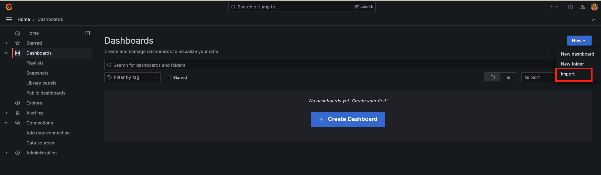
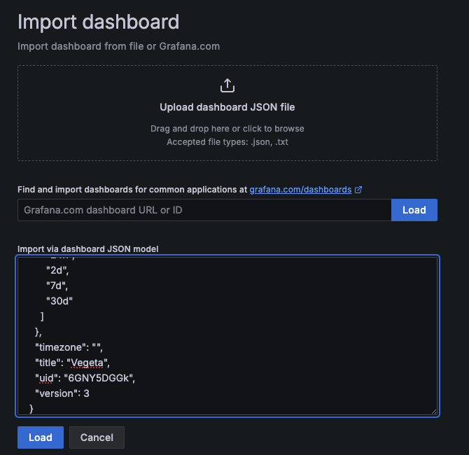
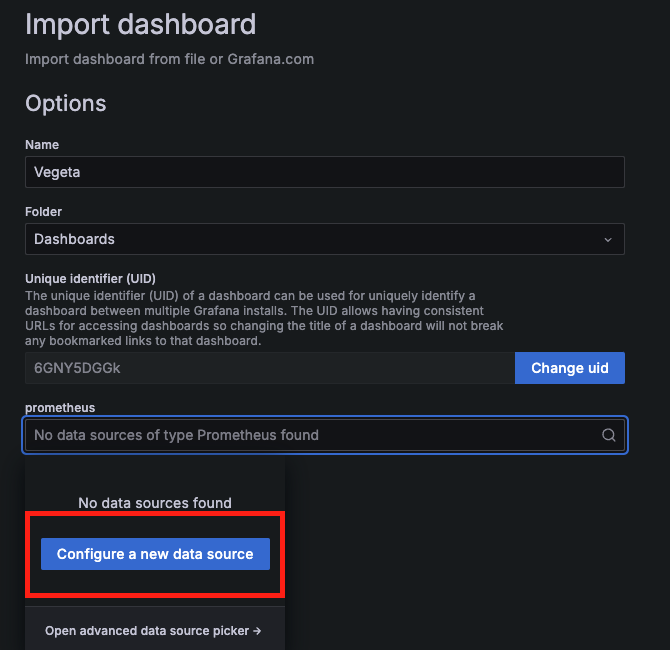
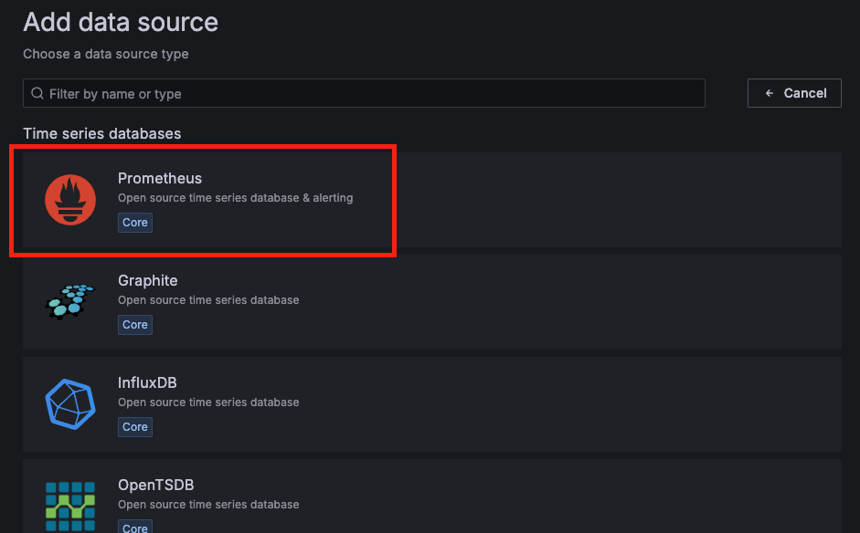
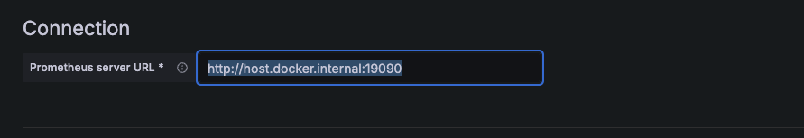
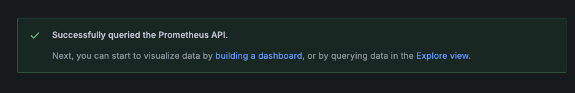
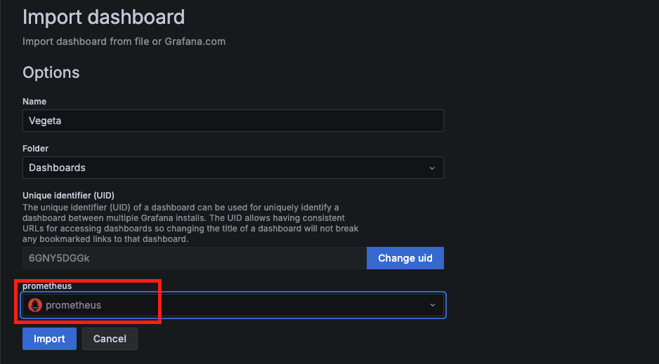
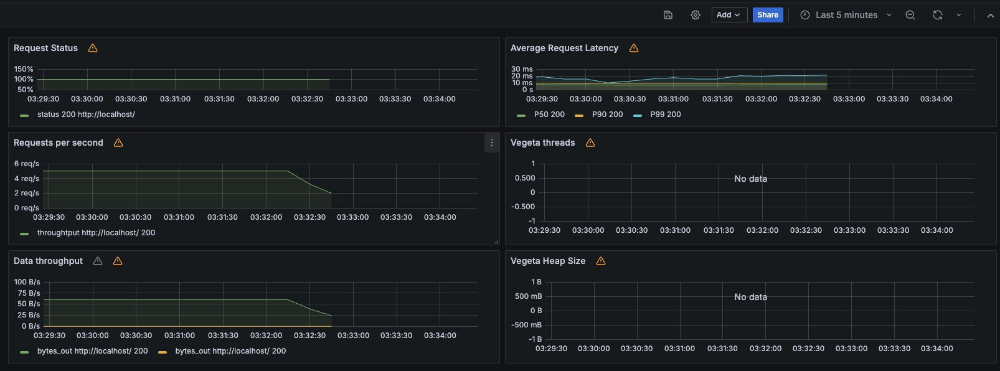

# Vegeta Prometheus Example

[Vegeta Github Repository](https://github.com/tsenart/vegeta)

## How to test it?

1. Start Prometheus and Grafana Docker containers using Docker Compose

    ```
    docker-compose up -d
    ```

2. Enable the Prometheus Exporter by activating the prometheus-addr flag on the command line. (For more details on prometheus-addr, refer to the Vegeta README.)

    ```
    echo "GET http://localhost" | vegeta attack -rate=5 -duration=600s -prometheus-addr localhost:8880 | vegeta report
    ```

3. Check if you receive a successful HTTP status code 200 response by accessing `localhost:8880/metrics` in your browser.

4. Access Grafana (localhost:13030) and navigate to the dashboard by clicking 'New' in the top right corner, then select 'Import'. (Default username/password for Grafana is admin/admin.)



5.  Paste the contents of [grafana.json](./grafana.json) and click 'Load'.
- [VegetaRepo/lib/prom/grafana.json](https://github.com/tsenart/vegeta/blob/master/lib/prom/grafana.json)


6. In the window for selecting a data source, click 'Configure a new data source'.


7. Choose Prometheus.


8. Enter the address and port of Prometheus in the 'Connection' field. Since you will be connecting to port 19090 via `http://host.docker.internal:19090`.



9. Scroll down and click 'Save & test'. You should see a successful request confirmation as shown below. 


10. Now, go back to the previous screen and select Prometheus as the data source. If it doesn't appear immediately, please refresh the page.


11. Change the time range filter to the last 5 minutes, and you will see the collected information displayed as a graph.
